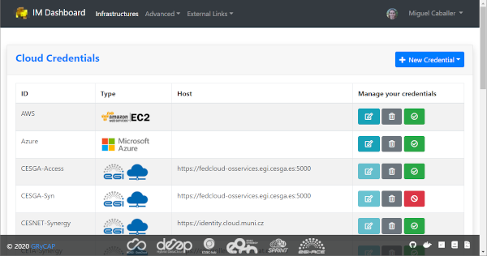
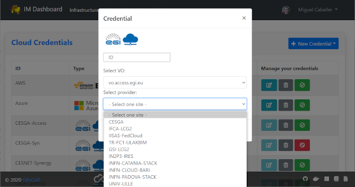
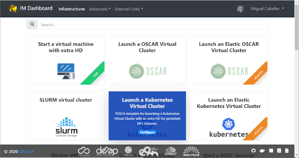
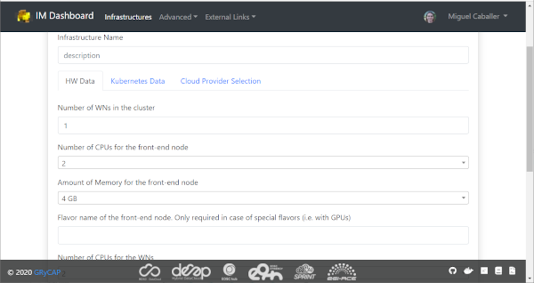
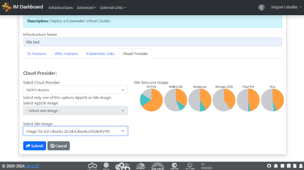
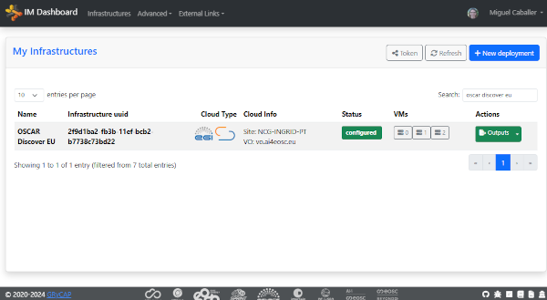
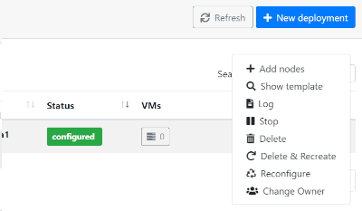
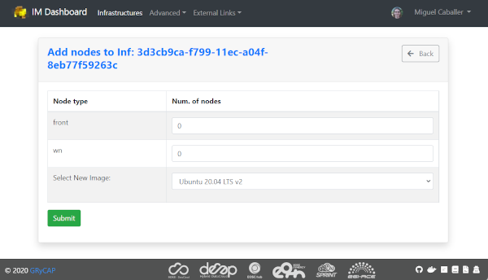
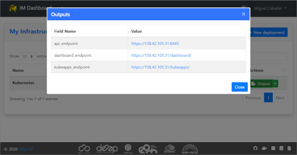

.. _dashboard:

=============
IM Dashboard
=============

The IM Dashboard is a graphical interface to access REST APIs of IM Server specially
developed to EOSC users to access EGI Cloud Compute resources.

Functionalities:

- OIDC authentication
- Display user's infrastructures
- Display infrastructure details, template and log
- Delete infrastructure
- Create new infrastructure

The im-dashboard is a Python application built with the `Flask <http://flask.pocoo.org/>`_ microframework; 
`Flask-Dance <https://flask-dance.readthedocs.io/en/latest>`_) is used for Openid-Connect/OAuth2 integration.

The docker image uses `Gunicorn <https://gunicorn.org/>`_ as WSGI HTTP server to serve the Flask Application.

How to deploy the dashboard
---------------------------

Register a client in an OIDC server with the following properties:

- redirect uri: `https://<DASHBOARD_HOST>:<PORT>/login/oidc/authorized`
- scopes: 'openid', 'email', 'profile', 'offline_access' ('entitlements' in EGI Check-In optional)
- introspection endpoint enabled

Create the `config.json` file (see the [example](app/config-sample.json)) setting the following variables:

+-----------------------+----------------------------------------------------------------------------------------------------------------------------------------------------------+---------------------+------------------------+
| **Parameter name**    | **Description**                                                                                                                                          | **Mandatory (Y/N)** | **Default Value**      |
+=======================+==========================================================================================================================================================+=====================+========================+
| OIDC_CLIENT_ID        | | OIDC client ID                                                                                                                                         | Y                   | N/A                    |
+-----------------------+----------------------------------------------------------------------------------------------------------------------------------------------------------+---------------------+------------------------+
| OIDC_CLIENT_SECRET    | | OIDC client Secret                                                                                                                                     | Y                   | N/A                    |
+-----------------------+----------------------------------------------------------------------------------------------------------------------------------------------------------+---------------------+------------------------+
| OIDC_BASE_URL         | | OIDC service URL                                                                                                                                       | Y                   | N/A                    |
+-----------------------+----------------------------------------------------------------------------------------------------------------------------------------------------------+---------------------+------------------------+
| OIDC_GROUP_MEMBERSHIP | | List of OIDC groups to be checked for allowing access                                                                                                  | N                   | []                     |
+-----------------------+----------------------------------------------------------------------------------------------------------------------------------------------------------+---------------------+------------------------+
| OIDC_SCOPES           | | OIDC scopes                                                                                                                                            | Y                   | N/A                    |
+-----------------------+----------------------------------------------------------------------------------------------------------------------------------------------------------+---------------------+------------------------+
| TOSCA_TEMPLATES_DIR   | | Absolute path where the TOSCA templates are stored                                                                                                     | Y                   | N/A                    |
+-----------------------+----------------------------------------------------------------------------------------------------------------------------------------------------------+---------------------+------------------------+
| TOSCA_PARAMETERS_DIR  | | Absolute path where the TOSCA parameters are stored                                                                                                    | Y                   | N/A                    |
+-----------------------+----------------------------------------------------------------------------------------------------------------------------------------------------------+---------------------+------------------------+
| IM_URL                | | Infrastructure Manager service URL                                                                                                                     | Y                   | N/A                    |
+-----------------------+----------------------------------------------------------------------------------------------------------------------------------------------------------+---------------------+------------------------+
| SUPPORT_EMAIL         | | Email address that will be shown in case of errors                                                                                                     | N                   | ""                     |
+-----------------------+----------------------------------------------------------------------------------------------------------------------------------------------------------+---------------------+------------------------+
| EXTERNAL_LINKS        | | List of dictionaries ({ "url": "example.com" , "menu_item_name": "Example link"})                                                                      | N                   | []                     |
|                       | | specifying links that will be shown under the "External Links" menu                                                                                    |                     |                        |
+-----------------------+----------------------------------------------------------------------------------------------------------------------------------------------------------+---------------------+------------------------+
| LOG_LEVEL             | | Set Logging level                                                                                                                                      | N                   | info                   |
+-----------------------+----------------------------------------------------------------------------------------------------------------------------------------------------------+---------------------+------------------------+
| DB_URL                | | URL to the DB to store dashbaord data                                                                                                                  | N                   | sqlite:///creds.db     |
+-----------------------+----------------------------------------------------------------------------------------------------------------------------------------------------------+---------------------+------------------------+
| ANALYTICS_TAG         | | Google Analytic Tag                                                                                                                                    | N                   | ""                     |
+-----------------------+----------------------------------------------------------------------------------------------------------------------------------------------------------+---------------------+------------------------+
| STATIC_SITES          | | List of static sites added to the AppDB ones. Format:                                                                                                  | N                   | []                     |
|                       | | [{"name": "static_site_name", "url": "static_site_url", "id": "static_id",                                                                             |                     |                        |
|                       | | "vos": {"vo": "stprojectid"}}]                                                                                                                         |                     |                        |
+-----------------------+----------------------------------------------------------------------------------------------------------------------------------------------------------+---------------------+------------------------+
| STATIC_SITES_URL      | | URL of a JSON file with the list of static sites added to the AppDB ones                                                                               | N                   | ""                     |
+-----------------------+----------------------------------------------------------------------------------------------------------------------------------------------------------+---------------------+------------------------+

You need to run the IM dashboard on HTTPS (otherwise you will get an error); you can choose between

- enabling the HTTPS support
- using an HTTPS proxy

Details are provided in the next paragraphs.

Enabling HTTPS
^^^^^^^^^^^^^^

You would need to provide

- a pair certificate/key that the container will read from the container paths `/certs/cert.pem` and `/certs/key.pem`;
- the environment variable `ENABLE_HTTPS` set to `True`

Run the docker container::

   $ docker run -d -p 443:5001 --name='im-dashboard' \
            -e ENABLE_HTTPS=True \
            -v $PWD/cert.pem:/certs/cert.pem \
            -v $PWD/key.pem:/certs/key.pem \
            -v $PWD/config.json:/app/app/config.json \
            -v $PWD/tosca-templates:/opt/tosca-templates \
            grycap/im-dashboard:latest

Access the dashboard at `https://<DASHBOARD_HOST>/`

Using an HTTPS Proxy
^^^^^^^^^^^^^^^^^^^^

Example of configuration for nginx::

   server {
         listen         80;
         server_name    YOUR_SERVER_NAME;
         return         301 https://$server_name$request_uri;
   }

   server {
   listen        443 ssl;
   server_name   YOUR_SERVER_NAME;
   access_log    /var/log/nginx/proxy-paas.access.log  combined;

   ssl on;
   ssl_protocols TLSv1 TLSv1.1 TLSv1.2;
   ssl_certificate           /etc/nginx/cert.pem;
   ssl_certificate_key       /etc/nginx/key.pem;
   ssl_trusted_certificate   /etc/nginx/trusted_ca_cert.pem;

   location / {
                  # Pass the request to Gunicorn
                  proxy_pass http://127.0.0.1:5001/;

                  proxy_set_header        X-Real-IP $remote_addr;
                  proxy_set_header        X-Forwarded-For $proxy_add_x_forwarded_for;
                  proxy_set_header        X-Forwarded-Proto https;
                  proxy_set_header        Host $http_host;
                  proxy_redirect          http:// https://;
                  proxy_buffering         off;
   }

   }

Run the docker container::

   $ docker run -d -p 5001:5001 --name='im-dashboard' \
            -v $PWD/config.json:/app/app/config.json \
            -v $PWD/tosca-templates:/opt/tosca-templates \
            grycap/im-dashboard:latest

**Warning!!** Remember to update the redirect uri in the OIDC client to `https://<PROXY_HOST>/login/oidc/authorized`

Access the dashboard at `https://<PROXY_HOST>/`

Performance tuning
^^^^^^^^^^^^^^^^^^

You can change the number of gunicorn worker processes using the environment variable WORKERS.
E.g. if you want to use 2 workers, launch the container with the option `-e WORKERS=2`
Check the `documentation <http://docs.gunicorn.org/en/stable/design.html#how-many-workers>`_ for ideas on tuning this parameter.

Enabling Credentials encryption
-------------------------------

To enable the encryption of the Cloud providers credentials (sensitive data), you have to set the `CREDS_KEY`
environment varible with a valid key used to encrypt/decrypt de data. To get a valid one you can use this 
python code (you will need `Cryptography <https://cryptography.io/>`_ ) library)::

   from cryptography.fernet import Fernet
   key = Fernet.generate_key()
   print(key.decode())

TOSCA Template Metadata
-----------------------

The IM dashboard can exploit some optional information provided in the TOSCA templates for rendering the cards describing the type of applications/services or virtual infrastructure that a user can deploy.

In particular, the following tags are supported:

+-----------------------+----------------------------------------------------------------------------------------------------------------------+
| **Tag name**          | **Description**                                                                                                      |
+-----------------------+----------------------------------------------------------------------------------------------------------------------+
| description           | | Used for showing the card description                                                                              |
+-----------------------+----------------------------------------------------------------------------------------------------------------------+
| metadata.display_name | | Used for the card title. If not pro                                                                                |
+-----------------------+----------------------------------------------------------------------------------------------------------------------+
| metadata.icon         | | Used for showing the card image. If no image URL is provided,                                                      |
|                       | | the dashboard will load this `icon <https://cdn4.iconfinder.com/data/icons/mosaicon-04/512/websettings-512.png>`_. |
+-----------------------+----------------------------------------------------------------------------------------------------------------------+
| metadata.display_name | | Used for the card title. If not provided, the template name will be used                                           |
+-----------------------+----------------------------------------------------------------------------------------------------------------------+
| metadata.tag          | | Used for the card ribbon (displayed on the right bottom corner)                                                    |
+-----------------------+----------------------------------------------------------------------------------------------------------------------+

Example of template metadata::

   tosca_definitions_version: tosca_simple_yaml_1_0

   imports:
   - indigo_custom_types: https://raw.githubusercontent.com/indigo-dc/tosca-types/v4.0.0/custom_types.yaml

   description: Deploy a Mesos Cluster (with Marathon and Chronos frameworks) on top of Virtual machines

   metadata:
   display_name: Deploy a Mesos cluster
   icon: images/mesos.png

   topology_template:

   ....

.. _use-dashboard:

Usage
-----
The dashbaord of the IM enables non advanced users to manage their infrastructures launching
a set of predefined TOSCA templates on top of EGI Cloud Compute resources. The dashboard does
not provide all the features provided by the IM service in case you need more advanced features
use the IM web interface.
 

Login
^^^^^

To login the dashbaord the user will use the `EGI Checkin OIDC <https://www.egi.eu/services/check-in/>`_
authentication system. Once authenticated, the user will be redirected to the portfolio of available
TOSCA templates. 

.. _figure_login:
.. figure:: images/dash_login.png

   Fig 1. Landing page.

Main menu bar
^^^^^^^^^^^^^^

The main menu bar is located on top of the pages:

* The first button "IM Dashboard" enables the user to go to the the portfolio of available TOSCA templates.
* Second item "Infrastructures" redirects to the list of current user deployed infrastructures.
* In the "Advanced" item the "Settings" subitem enables to see the some configuration settings as the URL
  of the IM service or the OIDC issuer.
* "External Links" show a set of configurables information links (documentation, video tutorials, etc.)
* Finally on the right top corner appears the "User" menu item. This item shows the full name of the logged user,
  and an avatar obtained from `Gravatar <https://www.gravatar.com/>`_. In this menu the user can access their 
  "Cloud Credentials" with the cloud providers, add his "SSH Keys" to be added to the VMs or logout the application.

Cloud Credentials
^^^^^^^^^^^^^^^^^^^

This page enable the user to specify the credentials to access any cloud provider it has access to.
In the list (:ref:`Fig. 2 <figure_dash_cred_list>`) the user can edit, delete and enable/disable the selected
cloud credential.

.. _figure_dash_cred_list:

   Fig 2. List of Cloud Credentials.

Editing or adding the credentials will show a modal form (:ref:`Fig. 3 <figure_dash_edit_cred>`) where the user has the 
ability to specify all the parameters needed to access each cloud provider supported. In particular for
`EGI Cloud Compute sites <https://www.egi.eu/services/cloud-compute/>`_ sites the user only has to select one of
the VOs he is member and one of sites that supports that VO. These dropdown fields are generated using the information
available from the sites and the list of VOs the user is member.

.. _figure_dash_edit_cred:

   Fig 3. Edit/Add a Credential.

SSH Keys
^^^^^^^^^

This page enables the user to add or delete public SSH Keys to be injected to the deployed VMs
to allow him to establish a secure connection between his computer and his virtual server(s).

The user can manage a set of SSH Keys that will appear in the SSK Keys list as 
depicted in :ref:`Fig. 4 <figure_dash_ssh_key_list>`. The user can delete the existing SSH Keys
from the list or add new ones using the "New SSH Key" Button on the top-right of the page.

.. _figure_dash_ssh_key_list:

   Fig 4. SSH Keys list.

If the "New SSH Key" a new modal form (:ref:`Fig. 5 <figure_dash_ssh_key_add>`) will be shown,
enabling the user to add a new key, setting a description that will be shown in the list.

.. _figure_dash_ssh_key_add:

   Fig 5. Add a new SSH Key.

TOSCA Templates
^^^^^^^^^^^^^^^^

The list of available TOSCA templates enable the user to select the required topology to deploy.
Each TOSCA template can be labelled by the TOSCA developer with any "tag" that will show a ribbon
displayed on the right bottom corner. An special "tag" is the elastic one that are used to mark the templates
that are configured to automatically manage the elasticity of the deployed cluster.

The user have to click on the "Configure" button to set the input values of the TOSCA template and 
also to select the VO, Site and Image to deploy the infrastructure (:ref:`Fig. 6 <figure_dash_configure>`).

.. _figure_dash_configure:

   Fig 6. List of TOSCA templates.

Initially the user can set a name to describe the infrastructure to be deployed. It will make easier to list infrastructures.
In the firsts tabs the user can introduce the set of input values of the toplogy. By default there is only one tab
called "Input Values" (:ref:`Fig. 7 <figure_dash_inputs>`), but the TOSCA developer can add/rename them to make 
easier the input values selection.

.. _figure_dash_inputs:

   Fig 7. TOSCA input values.

The final tab will be the "Cloud Provider Selection" (:ref:`Fig. 8 <figure_dash_site>`).
In this tab the user has to select: first, one of the Cloud providers that has been previously added (and not disabled) 
in the "Cloud Credentials" page, then it has to select the base image used to deploy the VMs.
In case of EGI Cloud Compute sites the user has two options, he can select an image from the list of images provided by the
`EGI AppDB information system <https://appdb.egi.eu/>`_ or from the list provided directly by the Cloud site.
Other providers will only show a dropdown list with the available images to use. Only in the case of AWS Cloud provider
the user has to specify manually the AMI id of the image to use.

.. _figure_dash_site:

   Fig 8. Select Cloud Provider and Image.

Furthermore, this tab will show the ammount of resources available in the selected Cloud provider.
The user can easily check the resources available in the selected Cloud provider and if the current
deployment will fit in the available resources. The information is shown in a set of pie charts
showing the total resources available and the resources used by the current user. Used resources are
shown in orange, free ones in grey, the needed resources for the deployment in green or red if they
do not fit in the available resources.In case that the amnount of resources used by the user is too high,
a message will be shown to the user indicating that the current deployment will not fit in the 
available resources.
(:ref:`Fig. 9 <_figure_dash_resources>`)

.. _figure_dash_resources:

   Fig 9. Cloud resources usage.

Infrastructures
^^^^^^^^^^^^^^^^

This page will show the list of infrastructures deployed by the current user (:ref:`Fig. 9 <figure_dash_inf_list>`).
The first column shows the name set by the user on infrastructure creation, then shows the ID assinged by the IM service,
third column shows the Cloud type where the infrastructure was deployed, next column shows information about the Cloud
provider, fifth column shows the current status of the infrastructure, sixth one shows the list of VMs with their IDs and
finally appears a button with a set of actions to perform to it (:ref:`Fig. 10 <figure_dash_inf_actions>`). Columns
"Cloud Type" and "Cloud Info" were added in version 2.2.0, infrastructures launched with previous versions will have
both columns empty.

.. _figure_dash_inf_list:

   Fig 10. List of infrastructures.

.. _figure_dash_inf_actions:

   Fig 11. List of infrastructure Actions.

**List of Actions**:

* Add nodes: The Add nodes action enables to add new VMs to the users' deployment. As depicted in
  :ref:`Fig. 11 <figure_dash_add_nodes>` it will show the list of different types of nodes currently deployed in 
  the infrastructure and the user have to set the number of nodes of each type he wants to deploy. It 
  will also show the image selected to create the VMs (if available). In the dropdown list the user can 
  change the base image, in case that you want to use a new one on the new deployed nodes, or the old one
  has been removed and you need to select a new one to be able to deploy them.

.. _figure_dash_add_nodes:

   Fig 12. Add nodes page.

* Show template: This action shows the original TOSCA template submitted to create the infrastructure.

* Log: Shows the error/contextualization log of the infrastructure.

* Stop: Stops/Suspends all the VMs of the infrastructure.

* Start: Starts/Resume previously stopped infrastructure.

* Outputs: Shows the outputs of the TOSCA template. In case of private key of credentials it enables to download it
  as a file or copy to the clipboard.

.. _figure_dash_outputs:

   Fig 13. TOSCA outputs.

* Delete: Delete this infrastructure and all the asociated resources. It also has the option to "Force" de deletion.
  In this case the infrastructure will be removed from the IM service even if some cloud resources cannot be deleted.
  **Only use this option if you know what you are doing**.

* Delete & Recreate: Delete this infrastructure as the previous option, but once it is deleted it will redirect to the
  infrastructure creation form, with all the input fields filled with the same set of values used to create the deleted
  infrastructure.

* Reconfigure: Starts the reconfiguration of the infrastructure.

* Change User: Add or change the ownership of the infrastructure at IM level. Setting an valid share token of other
  user, the infrastructure can be shared or transfered to another user. If overwrite check is set the new user will be
  the unique new owner of the infrastructure, otherwise it will be added to the list of current users. If the new user
  does not have the correct credentials to access the cloud provider where the resources were deployed the user will
  not be able to manage the cloud resources. To get the share token the user has to go to the infrastructure list page
  an chlick on the "Token" button. The token will be shown in a modal form and the user can copy it to the clipboard
  and then share it with the current owner of the infrastructure.

.. _figure_dash_change_user:
.. figure:: images/dash_change_user.png

   Fig 14. Change/Add User modal form.

**VM Info page**:

The VM Info page will show all the information about the selected VM and will enable to manage the lifecycle of it.
On the top right corner the "Manage VM" dropdown menu will enable: Stop/Start, Reboot, Resize, Reconfigure and Terminate the VM.
Furthermore the user can check the error/contextualization log of this particular VM.

The VM infomation is splitted in two dofferent tables, the first one with the main information: State, IPs, HW features and
the SSH credentials needed to access it. Second table will show other additional fields.

.. _figure_dash_vm_info:
.. figure:: images/dash_vm_info.png

   Fig 15. VM Info page.

In case of Resizing the VM the user must provide the new size of the VM in terms of number of CPUs and ammount of memory as
show in :ref:`Fig. 15 <figure_dash_vm_resize>`.

.. _figure_dash_vm_resize:
.. figure:: images/dash_vm_resize.png

   Fig 16. VM Resize modal form.
