IM Web Interface
================

The IM Web client is a graphical interface to access the XML-RPC or REST APIs of IM Server.

Installation
-------------

Prerequisites
^^^^^^^^^^^^^

IM web interface is based on PHP, so a web server (e.g. Apache) with PHP support must be installed.

Also the mcrypt PHP modules must be installed and enabled.

It is also required to install the PHP module to access SQLite databases.

In case of using the REST API it is also required to install the CURL PHP module.

Installing
^^^^^^^^^^

Select a proper path in the document root of the web server to install the IM web interface (i.e. /var/www/im)::

	$ tar xvzf IM-web-X.XX.tar.gz
	$ mv IM-X.XX /var/www/im
	$ chown -R www-data /var/www/im

.. _configuration:

Configuration
^^^^^^^^^^^^^

The web interface reads the configuration from :file:`$IM_WEB_PATH/config.php`. It has 
the following variables:

.. confval:: im_use_rest

   Flag to set the usage of the REST API instead of the XML-RPC one.
   The default value is `false`.

.. confval:: im_use_ssl

   Flag to set the usage of the APIs using HTTPS protocol instead of the standard HTTP.
   The default value is `false`.

.. confval:: im_host

   Hostname or IP address of the host with the IM service.
   The default value is `localhost`.

.. confval:: im_port

   Port where the IM service is listening.
   The default value is `8899`.

.. confval:: im_db

   Location of the D.B. used by the web interface.
   The default value is `/home/www-data/im.db`.

.. confval:: recipes_db

   Location of the IM service recipes D.B. To use that feature the IM recipes file must accessible to the web server
   The default value is `""`.

.. confval:: openid_issuer

   OpenID Issuer supported use "" to disable OpenID support.
   The default value is `""`.

.. confval:: openid_name

   OpenID Issuer name.
   The default value is `""`.

.. confval:: CLIENT_ID

   OpenID Client data.
   The default value is `""`.

.. confval:: CLIENT_SECRET

   OpenID Client data.
   The default value is `""`.

.. confval:: REDIRECT_URI

   OpenID Redirect URI.
   The default value is `""`.

.. confval:: cred_crypt_key

   Key to crypt the credentials data. It must be 32 chars long.
   The default value is `"n04ykjinrswda5sdfnb5680yu21+qgh3"`.

Docker Image
------------

A Docker image named `grycap/im-web` has been created to make easier the deployment of an IM web GUI using the 
default configuration. Information about this image can be found here: `https://registry.hub.docker.com/u/grycap/im-web/ <https://registry.hub.docker.com/u/grycap/im-web/>`_.

This container is prepaired to work linked with the IM service container `grycap/im`, in this way:

* First launch the IM service specifying the name "im":

``sudo docker run -d -p 8899:8899 --name im grycap/im``

* Then launch the im-web container linking to the im:

``sudo docker run -d -p 80:80 --name im-web --link im:im grycap/im-web``

* It also supports environment variables to set the IM service location:

  * `im_use_rest`: Uses the REST API instead of the XML-RPC that is the default one. Default value "false".
  * `im_use_ssl`: Uses HTTPS to connect with the REST or XML-RPC APIs. Default value "false".
  * `im_host`: Hostname of the IM service. Default value "im".
  * `im_port`: Port of the IM service. Default value "8899".
  * `im_db`: Location of the D.B. file used in the web application to store data. Default value "/home/www-data/im.db".
  * `openid_issuer`: OpenID Issuer supported use "" to disable OpenID support.
  * `openid_name`: OpenID Issuer name.
  * `client_id`: OpenID Client data.
  * `client_secret`: OpenID Client secret.
  * `redirect_uri`: OpenID Redirect URI.
  * `cred_crypt_key`: Key to crypt the credentials data. It must be 32 chars long.

``docker run -p 80:80 -e "im_use_rest=true" -e "im_host=server.domain" -e "im_port=8800" -d grycap/im-web``

There is also a version SSL enabled. In this case the docker image have a selfsigned certificate for testing purposes.
Add your own in the docker command:

``docker run -p 80:80 -p 443:443 -v server.crt:/etc/ssl/certs/server.crt -v server.key:/etc/ssl/certs/server.key -d grycap/im-web:1.5.5-ssl``

.. _use-web:

Usage
-----
The web interface of the IM enables the user to manage all the aspects related with the 
management of the life-cycle of his virtual infrastructures. 

Register
^^^^^^^^

To access the we interface the user must register first to the application. Each user
must include a username and a password to access the platform. From 1.5.6 version OpenID
authentication has been added.

.. _figure_register:
.. figure:: images/register.png

   Fig 1. Register page.

Credentials
^^^^^^^^^^^

The first step is to manage the user credentials to access all the components of the
platform, specially the Cloud providers. :ref:`Fig. 2 <figure_cred_list>` shows a list
of user credentials. In this list there are two related with the IM components:

 * InfrastructureManager: user and password to access the IM service.
 * VMRC: user, password and URL to access the `VMRC <http://www.grycap.upv.es/vmrc>`_ service

When a new user is registered (or access with OpenID credentials) the web UI automatically creates
credentials to both of them to make easier the creation of credentials process. The rest of elements
of this list are the user credentials to access diferent Cloud providers.

.. _figure_cred_list:
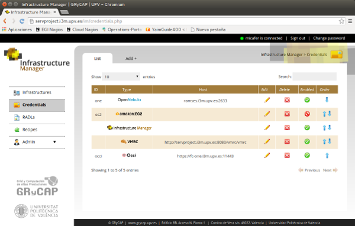

   Fig 2. List of credentials.

:ref:`Fig. 3 <figure_cred_add>` shows the form to add or edit the user credentials. Initially the user must
select the credentials type using the selectors with the corresponding images type. Then the specific form
for the Cloud provider selected will be shown, where the user must fill the needed fields.   

.. _figure_cred_add:   
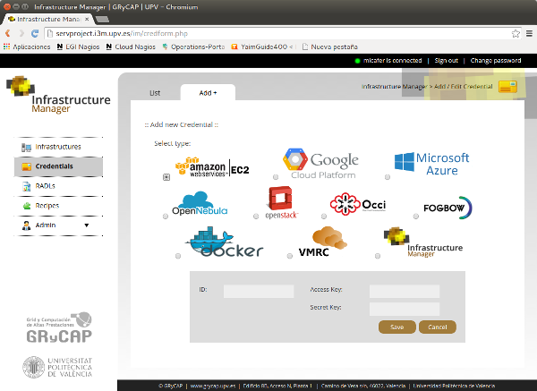

   Fig 2. Add new credential.

RADLs
^^^^^

The RADL section enables the management and share RADL documents with other users of the platform.
:ref:`Fig. 4 <figure_radl_list>` shows the list of RADLs available for an specific user. 
From the list the user can manage the RADLs and also launch the infrastructure described 
in the RADL with a single click with the launch button. 

.. _figure_radl_list:
.. figure:: images/radl_list.png

   Fig 4. List of RADL documents.

In case of using a `parametric value <http://www.grycap.upv.es/im/doc/radl.html#parametric-values>`_ 
in the RADL document. The web interface will ask for them showing a modal dialog as in
:ref:`Fig. 5 <figure_radl_params>`.

.. _figure_radl_params:   
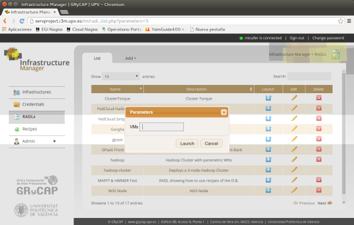

   Fig 5. Launch a parametric RADL.

The user can add or edit an RADL document (if the they have the correct permissions). In this
case the platform will show the RADL document form (:ref:`Fig. 6 <figure_radl_edit>`). In the top
of the form the user can edit the RADL document that describes the infrastructure to be launched. 
In the botton he can manage the access permissions to the document to users of an specific group
(Permission_Group) or to all the platform users (Permission_Other). It uses a similar schema of 
linux file systems. The user can give other users access to read (r), modify (w) or launch (x) the
RADL document. 

.. _figure_radl_edit:   
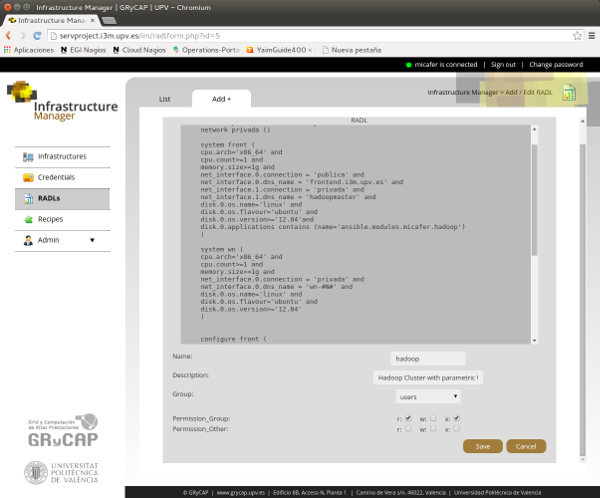

   Fig 6. Edit a RADL document and permissions.

Infrastructures
^^^^^^^^^^^^^^^

The Infrastructures section enables the management of the infrastructures owned by the current user 
available in the IM service. The list (:ref:`Fig. 7 <figure_inf_list>`) shows a row for each infrastructure.
The user can access the information about each VM of the infrastructure clicking in the ID of desired VM.  
He can also click in the message ``Show`` of the column ``Cont. Message`` to check the contextualization 
log as shown in :ref:`Fig. 9 <figure_cttxt_log>`. In case of failure of the contextualization process
the ``Reconfigure`` button will be available enbling the user to invoke the ctxt. step again. 
The user can also delete the whole infrastructure or add new resources using the buttons of the next columns. 
When adding new resources the form show in :ref:`Fig. 9 <figure_inf_add>` will appear. 
In this form the user will specify the RADL to add resources to the infrastructure.

.. _figure_inf_list: 
.. figure:: images/inf_list.png

   Fig. 7. List of user infrastructures.

In the VM information page (:ref:`Fig. 8 <figure_vm_info>`) the user can see all the information about the VM.
In the top of the page the state, the cloud provider where it is deployed and the available IPs are shown.
The rest of RADL fields are shown below. In this section the user can look up for the credentials needed to access the VM
(username, password or private_key). In case of the private_key a "download" button will appear enabling the user to
download the key to a file to acccess the node. The contextualizacion message of this VM will be show if the user press
the message "Show >>" of the row "Cont. Message". The user can also stop, start and destroy the VM using the buttons 
located at the bottom of the page. 

.. _figure_vm_info: 
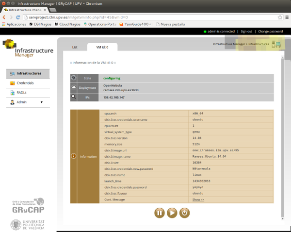

   Fig. 8. Information about a VM of the infrastructure.
  
.. _figure_cttxt_log:
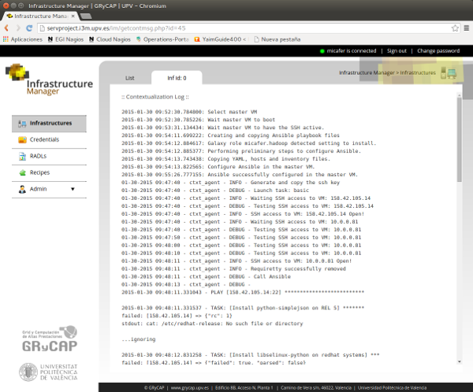

   Fig 9. Contextualization log of the infrastructure.
   
.. _figure_inf_add:
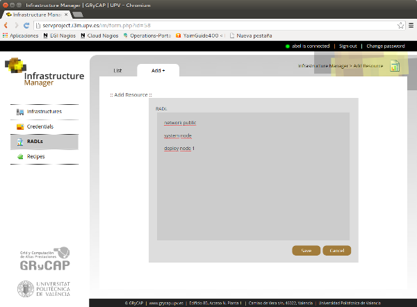

   Fig 10. Add new resources to a running infrastructure.

Recipes
^^^^^^^

The Recipes section enables the management of a set of recipes to make easy the installation of
certain applications to non advanced users. This feature is only enabled in case that the IM service 
recipes database is available to the web interface (see :ref:`configuration`). Only Admin users can
manage recipes. "Standard" users can only see the recipes and use it in their RADL documents adding
application requirements like the following::

	disk.0.applications contains (name='<application_name>' [and version='<application_version>'])

.. _figure_recipes_list:
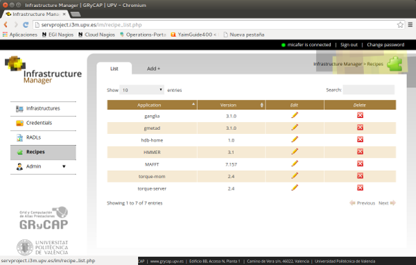

   Fig 11. List of recipes.

:ref:`Fig. 12 <figure_recipe_add>` shows the form to edit the recipe properties. The Admin user has to 
specify:

* Name and version: Name a version of the application to be identified in the RADL document.
* Description: A text to describe the recipe
* Module: A module enable to group similar recipes in modules. 
* Galaxy Module: If the recipe need to download an `Ansible Galaxy <http://galaxy.ansible.com>`_ module 
  it must be specified here, otherwise leave it blank. 
* Recipe: The steps in Ansible language to install the application. 
* Requirements: Some hardware requirements of the application. It will me merged with the RADL
  document where the application is included.

.. _figure_recipe_add:
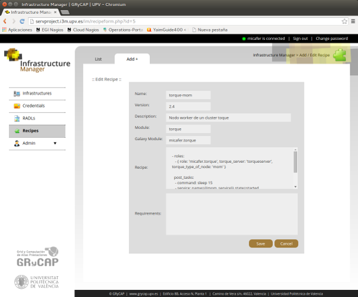

   Fig 12. Form to edit/add a recipe (only admin users).

Admin
^^^^^

In the Admin section, users with administrator permissions can manage users and groups of the web interface.
Figures :ref:`13 <figure_user_list>` and :ref:`14 <figure_user_edit>` shows the pages to manage users.
The Admin user can assign groups to users and set the flag of "administrator". 

.. _figure_user_list:
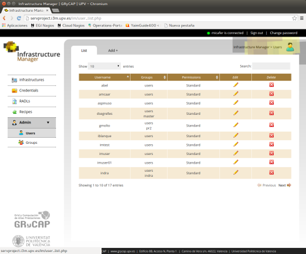

   Fig 13. List of users in the web interface.
   
.. _figure_user_edit:
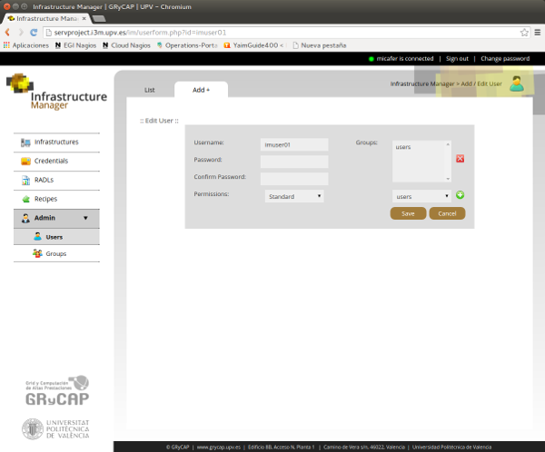

   Fig 14. Edit user data.

Figures :ref:`15 <figure_group_edit>` and :ref:`16 <figure_group_edit>` shows the pages to manage groups.
   
.. _figure_group_list:
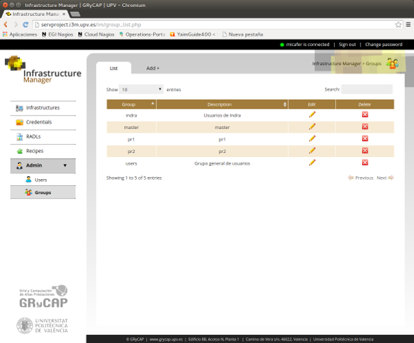

   Fig 15. List of groups in the web interface.
   
.. _figure_group_edit:
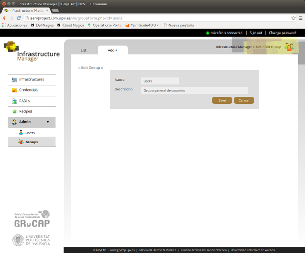

   Fig 16. Edit group data.
